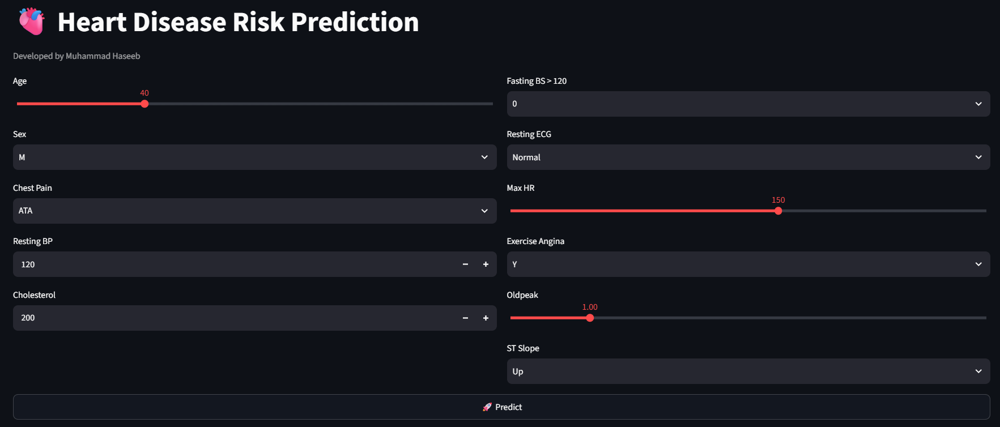
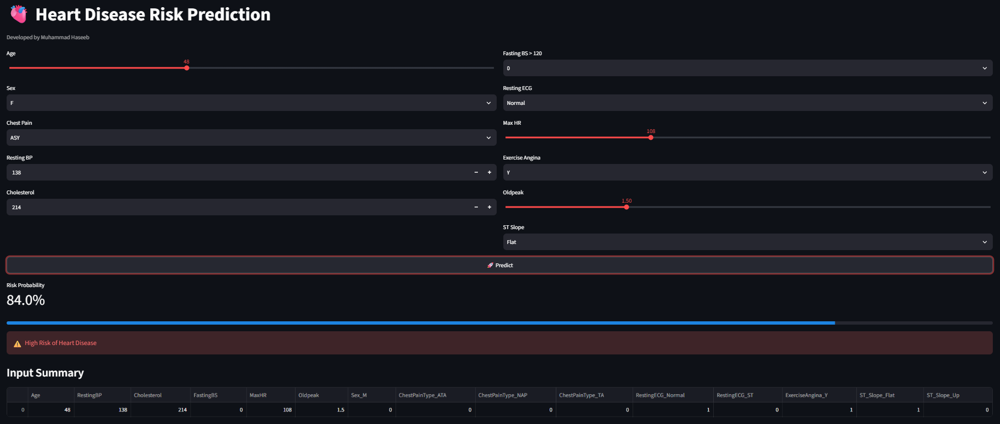
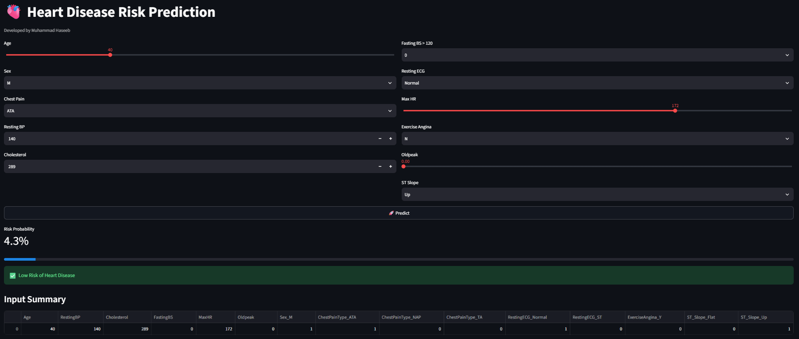

# 🫀 Heart Disease Risk Prediction System

An end-to-end Machine Learning web application that predicts the risk of heart disease based on patient health parameters using **Logistic Regression** and **Streamlit**.

---

## 🌐 Live Demo

🔗 https://heart-disease-prediction-system-ngdat7vgkafegzgsqgwibd.streamlit.app

---

## 📌 Project Overview

This project uses a machine learning classification model to predict whether a person is at **High Risk** or **Low Risk** of heart disease based on medical information such as age, blood pressure, cholesterol, heart rate, chest pain type, ECG results, and other clinical features.

The project covers the complete machine learning workflow:

- Data Cleaning
- Exploratory Data Analysis (EDA)
- Feature Engineering
- Model Training
- Model Comparison
- Model Evaluation
- Model Saving using Joblib
- Streamlit Web App Deployment

---

# 📊 Dataset

- Dataset: Heart Disease Dataset
- Total Records: **918**
- Target Variable: **HeartDisease**
  - 0 = Low Risk
  - 1 = High Risk

---

# 🧠 Machine Learning Models

The following models were trained and evaluated:

| Model | Accuracy | F1 Score |
|--------|---------:|---------:|
| ✅ Logistic Regression | **86.96%** | **0.8846** |
| K-Nearest Neighbors | 86.41% | 0.8815 |
| Naive Bayes | 84.78% | 0.8614 |
| Decision Tree | 79.35% | 0.8137 |
| SVM (RBF Kernel) | 84.78% | 0.8667 |

### 🏆 Best Model

**Logistic Regression**

Accuracy: **86.96%**

---

# ✨ Features

- Predict Heart Disease Risk
- Interactive Streamlit Interface
- Logistic Regression Model
- Automatic Data Scaling
- One-Hot Encoded Features
- Probability Prediction
- Fast Predictions

---

# 🛠️ Technologies Used

- Python
- Pandas
- NumPy
- Scikit-learn
- Joblib
- Streamlit

---

# 📂 Project Structure

```
heart-disease-prediction-system/
├── screenshots/
│   ├── home.png
│   ├── high_risk.png
│   └── low_risk.png
├── app.py
├── heart.ipynb
├── heart.csv
├── heart_scaler.pkl
├── heart_columns.pkl
├── Logistic_Regression_heart_model.pkl
├── requirements.txt
└── README.md
```

---

# 🚀 Installation

Clone the repository

```bash
git clone https://github.com/Haseeb-997/heart-disease-prediction-system.git
```

Move into the project folder

```bash
cd heart-disease-prediction-system
```

Install dependencies

```bash
pip install -r requirements.txt
```

Run the application

```bash
streamlit run app.py
```

---

# 📸 Screenshots

## 🏠 Home Page



---

## 🔴 High Risk Prediction



---

## 🟢 Low Risk Prediction


---

# 🔮 Future Improvements

- Deep Learning Model
- XGBoost & Random Forest
- Better UI/UX
- Risk Visualization Charts
- User Authentication
- Cloud Database Integration

---

# 👨‍💻 Developer

**Muhammad Haseeb**

- BS Computer Science Student
- Machine Learning Enthusiast
- Python Developer

---

# ⭐ Support

If you like this project, don't forget to **⭐ Star this repository**.

---

## 📄 License

This project is open-source and available under the MIT License.
